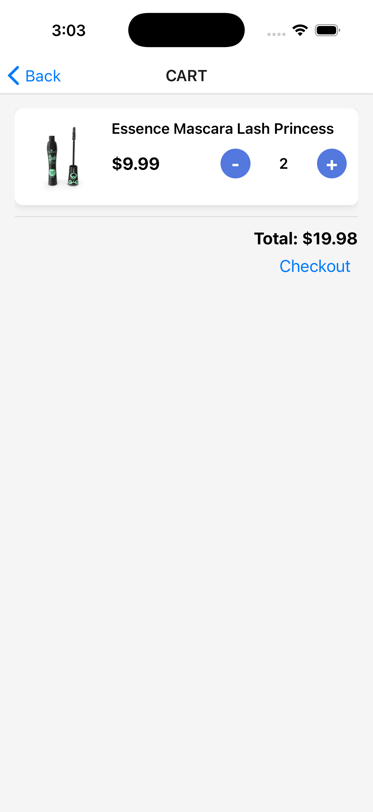
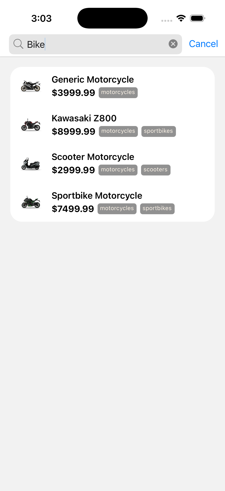
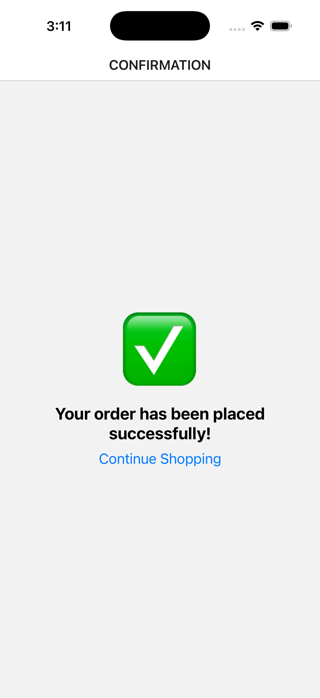
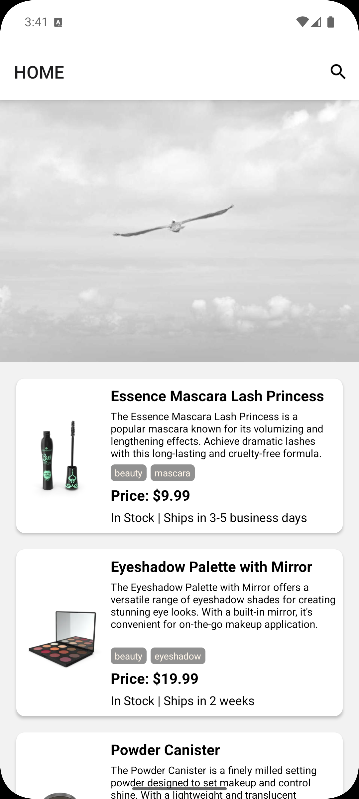
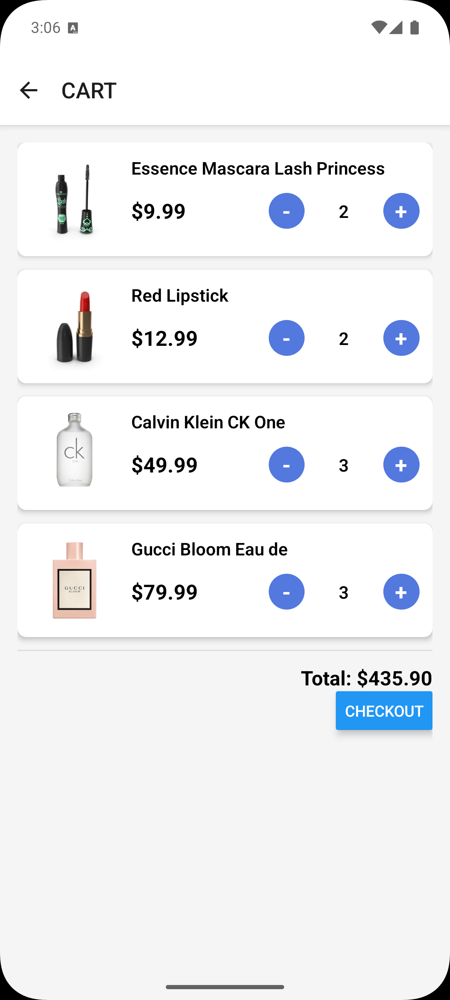
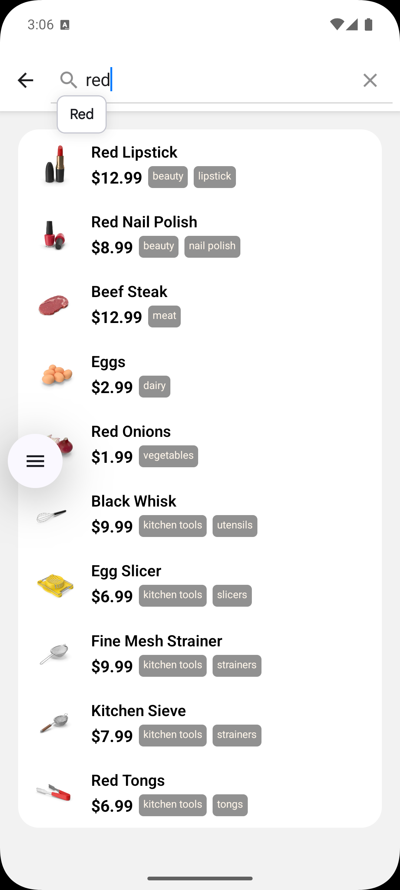
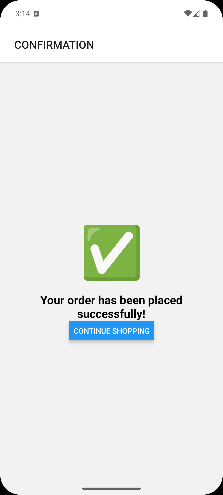

This is a new [**React Native**](https://reactnative.dev) project, bootstrapped using [\`@react-native-community/cli\`](https://github.com/react-native-community/cli).

# Getting Started

> **Note**: Make sure you have completed the [Set Up Your Environment](https://reactnative.dev/docs/set-up-your-environment) guide before proceeding.

## Step 1: Install Node Modules

First, you will need to install **Node Modules**.

To install the __node_modules__, run the following command from the root of your React Native project:

```sh
yarn
```

## Step 2: Build and run your app

Once you have installed \`node_modules\` you can run below command to build and run your app on your connected device or emulator.

### Android

```sh
yarn android
```

### iOS

For iOS, remember to install CocoaPods dependencies (this only needs to be run on first clone or after updating native deps).

The first time you create a new project, run the Ruby bundler to install CocoaPods itself:

```sh
bundle install
```

Then, and every time you update your native dependencies, run:

```sh
bundle exec pod install
```

For more information, please visit [CocoaPods Getting Started guide](https://guides.cocoapods.org/using/getting-started.html).

```sh
# Using npm
npm run ios

# OR using Yarn
yarn ios
```
# Project Structure
Below directory structure is followed in the project.

```
src/
├── assets
│   ├── fonts
│   └── img
├── api
├── components
├── hooks
├── navigator
├── queries
├── screens
├── store
├── theme
├── types
└── utils
```

| Directory | Details |
| ------- | ------- |
| assets | Asset directory contains images, json, fonts files used in the project. |
| components | The components directory contains reusable components used in the project. |
| queries | The queries directory contains API call logic and data fetching hooks using \`react-query\`. |
| hooks | Hooks directory contains all the reusable hooks i.e. \`useAppDispatch\`, \`useAppSelector\` |
| navigator | Navigator directory contains router logic and screen declaration using \`react-navigation\` library. |
| screens | The screens directory contains implementation of the screens declared in navigator. |
| store | The store directory contains \`slice\` and store configuration. \`Slices\` exported their \`reducer\` & \`actions\` for uses in the code. |
| theme | The theme directory has files related to text configuration, sizes, font and colors used through out the app. These are defined to have consistent design system in the app. |
| types | The types directory contains \`typescript\` declaration using \`.ts\` & \`.d.ts\`. It has \`react-navigation\` type safety declarations as well. |
| utils | The utils directory contains utility method used inside app i.e. \`date\`, \`platform\` and \`string constants\`. |


### 🚀 NativeFileView TurboModule
---
There is directory at root level of the project named `specs`. This directory contains a `TurboModule` spec declaration that is implemented in Android for view `PDF/Image` file.

## 📺 Demo
###  iOS
|  |  |   |  |  |
| ------- | ------- | ------- | ------- | ------- |
|  |  |  |  |  |
### 📲 Android
|  |  |   |  |  |
| ------- | ------- | ------- | ------- | ------- |
|  |  |  |  |  |